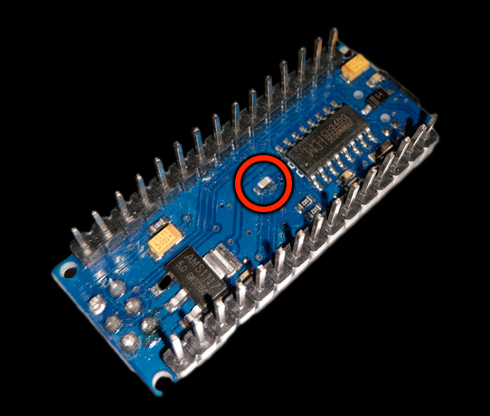
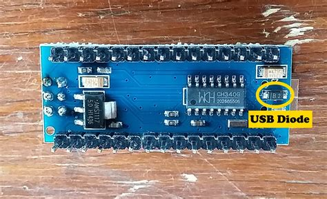

# Arduino Modifications

## Disable auto-reset on serial connection
- The Arduino Nano will reset on any serial connection being established.
- Remove the indicated capacitor to disable this.
- Tweezers and a soldering iron are recommended.
- Note that the exact location of the capacitor can differ on Nano variants.

## Prevent USB backpower to 5v and 12v rails
- The Arduino Nano allows the USB input to backpower the 5v and Vin pins.
- If connected with USB to a computer where the USB ports remain powered on shutdown, backpowering can occur.
- This may damage the Arduino and/or the computer, or result in unwanted behaviour.
- Remove the indicated diode to prevent this.
- Tweezers and a soldering iron are recommended.
- Note that the exact location of the diode can differ on Nano variants.

## Warning
- Please note that these changes are easy to perform, but reversing them takes skill in small-scale soldering.
- For the regular user, please understand that this is essentially a permanent modification of the Nano.